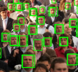
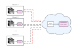

## Technical Skills
### Computer Vision, Natural Language Processing, Machine Learning, Artificial Intelligence, C++, Python, C, C#, Java, Pytorch, TensorFlow, Kali Linux, HTML5, CSS, JavaScript, PHP, jQuery, AJAX, SQL, Firebase, XML, Accela, Crystal Reports, Toad SQL Server

## Education 
- M.S., Computer Science | University of Central Florida (_May 2024_)
- B.S, Computer Science with a minor in Psychology | Florida State University (_December 2021_)
- A.A, General Degree | Eastern Florida State College (_May 2015_)

## Research

<table>
  <tr>
    <td></td>
    <td>
      

        <b>Comparative Study of Facial Detection Algorithms</b>
         
        

          <a href="https://github.com/mbcruz96/Facial-detection/blob/main/Report.docx">docx</a>
          <a href="https://github.com/mbcruz96/Facial-detection">Code</a>
        

       

    </td>
  </tr>
</table>
**Comparative Study of Facial Detection Algorithms**
- 
- Researched Haars Cascade, MTCNN, Dlib, DNN, RetinaFace, and HOG facial detection algorithms in efforts to compare their performances.
- Implemented all algorithms in three mediums: photos, videos, and live-stream videos.
- **Goal:** To determine the performance of currently used facial detection algorithms, highlighting the benefits and limitations of each in different situations
- [Research](https://github.com/mbcruz96/Facial-detection)

**Clinical Report Generator using Federated Learning**
- 
- Designed a Transformer model with the following architecture: a multimodal CNN encoder and a generative LSTM decoder to generate clinical reports based off individual patient diagnostic information.
- After training multiple models, the model weights were averaged using Federated Learning to create a global model and propagated the weights back to each individual model.
- By utilizing a federated learning, the model could be upscaled so that hospitals could use the model to generate clinical reports without sharing private patient information across hospitals.
- **Goal:** To implement a model that would allow medical data to be used in deep learning models without breaching constraints imposed by HIPPA
- [Research](https://github.com/mbcruz96/Clinical-Report-Generation.git)

**Optimal Hardware Implementation of Multi-Level Cache Based on Software Simulations**
- 
- Research centered around designing various multi-level cache software implementations with various architectures and measuring each implementation on how it impacts power consumption, timing, and utilization on a benchmark FPGA
- The cache simulators determined the optimal miss rate which was implemented in hardware via Verilog, SystemVerilog, and Vivado
- **Goal:** Determine the hardware benefits and drawbacks of high-performance multi-level cache designs as well as finding the optimal design architecture
- [Research](https://github.com/mbcruz96/Cache-Simulator)
  
## Projects
**Canny Edge Detector**
- Implemented the Canny Edge Detector
- Images are smoothed using a Gaussian filter and then their orientations and magnitudes are calculated.
- Non-maximum suppression is performed on the image pixels to discover true edge pixels.
- Using hysterisis thresholding, dominant edge pixels are discovered using eight way connectivity. 
- [Code](https://github.com/mbcruz96/Canny-Edge-Detection.git)

**Digit AutoEncoder**
- Using the MNIST dataset, an autoencoder model was implemented that predicts what digit a photo contains
- The model encodes the image into a latent space and decodes a representation of the original image with upsampling
- [Code](https://github.com/mbcruz96/AutoEncoder)

**Otsu Thresholding**
- Implemented the Otsu thresholding algorithm for binary image segmantation
- This implementation iteratively uses each pixel intensity from 0-255 to calculate the intra class variance between the two distributions using the current iteration's pixel intensity as the seperating boundary of the distributions.
- The intensity which yields the highest variance amongst the distributions is chosen as the thresholding value used to alter the original image.
- [Code](https://github.com/mbcruz96/Otsu)

**Comparative Convolutional Neural Network Designs**
- Using the MNIST dataset, multiple convolutional neural network architectures were designed to see how different architectures affect the quality of the model.
- Through command line interface, five different models can be selected with different numbers of layers, activations, and hyperparameters. Each model will train and accuracy and precision are calculated and displayed for each iteration.
- [MNIST Code](https://github.com/mbcruz96/ConvNet/tree/main/MNIST)
- Using the CIFAR-10 dataset, different hyperparameters were used in order to determine which hyperparameters affected the model's training the most.
- Accuracy and precision were calculated and loss curves were graphed for the different configurations to find the optimal model architecture.
- [CIFAR-10 Code](https://github.com/mbcruz96/ConvNet/tree/main/CIFAR-10)
- [Code](https://github.com/mbcruz96/ConvNet)

**Fine-tuning vs Linear Probing Transformers**
- The BERT tranformer model was fine-tuned for the down-stream task of sentiment classification.
- Another classifier was trained on the same transformer using linear probing so that the previous model parameters were not trained with the new classifier.
- The classification precision and accuracy of both models were compared.
- [Code](https://github.com/mbcruz96/Fine-Tune-BERT)

**Generative Shakespearian Speech Model**
- NLP model that generates text in the style of Shakesperian english
- The model is pretrained on a corpus containing some of Shakespear's work
- Using a seed, the model generatively creates sentances reminiscent of old English vernacular
- [Code](https://github.com/mbcruz96/LSTM/blob/main/TextGenerator.ipynb)

**Sentiment Analysis**
- Designed multiple sentiment classifier architectures.
- Using different activation functions as well as different numbers of layers the optimal model was determined which accomplishes the task of sentiment analysis.
- [Code](https://github.com/mbcruz96/Neural-Network)

**Topic Modeling**
- Comparatively studied the best methods to accomplish the NLP task of topic modeling.
- Both bag-of-words and TF-IDF representations were used to create the models and their performances were compared.
- An LSA model and an LDA model were created and the top 10 topics and top 20 words from each topic were determined and compared for accuracy.
- [Code](https://github.com/mbcruz96/topic-modeling)

**Artificially Intelligent Pac-Man Simulation**
- Using Berkley's Pac-Man simulator, various artificial intelligence techniques were implemented to automate the video game Pac-Man effieciently.
- Implemented artificial intelligence search methods including depth first search, breadth first search, a-star search, and uniform cost search, to enable Pac-Man to optimally consume all of the dots in the plane.
- Designed and implemented Q-learning and Value iteration reinforcement learning techniques to find the best policy for the model
- [Code](https://github.com/mbcruz96/Search-Agents)
  
**Weak Heap**
- Implemented a heap varient, a weak heap
- The weak heap removes the shape constraint of the classic heap structure via reverse bits to lower computation cost of the data structures operations
- [Code](https://github.com/mbcruz96/Weakheap)
  
**Python Dungeon Crawler VideoGame**
- Implemented an Isometric dungeon crawler
- A sqlite3 database was used to save highscores for each completed run.
- Pygame was used as the primary development library along with the native libraries: Math, os, random, and time.
- [Code](https://github.com/mbcruz96/Python-Game)

**FAT32 File System**
- Designed a FAT32 filesystem and all of its' operations
- [Code](https://github.com/mbcruz96/FAT32)
 
**Elevator Kernel Module**
- Created a kernel module that simulates the functionality of an elevator
- Compared different implementations to find optimal policies
- Added system calls to the OS and used said calls in a module that utilized concurrent threads in C
- [Code](https://github.com/mbcruz96/Elevator-Kernel-Module)
  
**DES Encryption**
- Implementation of the DES encryption algorithm
- [Code](https://github.com/mbcruz96/DES/tree/main)
  
**MCTL template library**
- Created the Michael Cruz template library, which implements some of the data structures available in the C++ std library.
- [Code](https://github.com/mbcruz96/MCTL.git)

  
  
